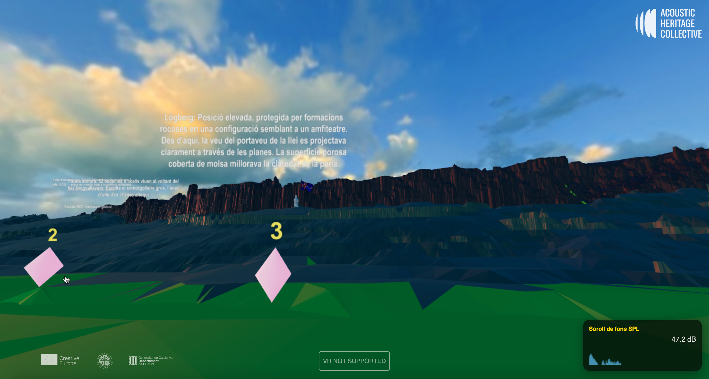

# 🇮🇸 Þingvellir 3D — Interactive Archaeoacoustics Experience

An immersive 3D/VR web experience exploring the acoustic heritage of Þingvellir, Iceland — site of the Alþing, one of the world's first democratic assemblies (930–1262 AD).

**🔗 Live ENG demo:** [acousticheritagecollective.org/thingvellir/3d-vr](https://acousticheritagecollective.org/thingvellir/3d-vr/)
**🔗 Live CAT demo:** [acousticheritagecollective.org/thingvellir/3d-vr](https://acousticheritagecollective.org/thingvellir/3d-vr/index-cat.html)
**🔗 Live ISL demo:** [acousticheritagecollective.org/thingvellir/3d-vr](https://acousticheritagecollective.org/thingvellir/3d-vr/index-isl.html)



## About

Could the exceptional acoustics of Þingvellir have influenced its selection as the site for the Alþing? This interactive experience presents the main findings of a hybrid archaeoacoustics study conducted by the **Acoustic Heritage Collective**, combining in-situ measurements and digital simulations.

Walk between the North American and Eurasian tectonic plates, listen to the echoes of the rift valley, and discover how sound behaves in this UNESCO World Heritage landscape. Explore how its acoustic characteristics may have shaped one of the most significant meeting places in Icelandic history.

## Features

- **3D Terrain Navigation** — Explore a photogrammetric reconstruction of the Þingvellir landscape using keyboard controls or VR controllers
- **WebXR / VR Support** — Full immersive VR mode via the WebXR API with joystick-based locomotion
- **Spatial Audio Engine** — Positional 3D audio using the Web Audio API and Three.js `PositionalAudio`, including ambient river sounds, birdsong, and proximity-triggered narrative audio
- **Narrative Discovery Points** — Six interactive waypoints with narrated audio content placed at historically significant locations
- **Interactive Facts** — Proximity-triggered info panels presenting research findings on geology, orality at Lögberg, the Icelandic sagas, and Þingvellir's distinctive echo
- **Real-time Sound Meter** — Live SPL (Sound Pressure Level) display with frequency spectrum visualization
- **Surface-aware Footsteps** — Adaptive footstep sounds that change based on terrain type (grass, gravel, rock, water)
- **Impulse Response Playback** — Listen to the actual acoustic impulse response captured at the site

## Tech Stack

| Technology | Purpose |
|---|---|
| [Three.js](https://threejs.org/) (r161) | 3D rendering, scene management, lighting |
| WebXR API | VR headset support |
| Web Audio API | Spatial audio, sound analysis, SPL metering |
| GLTFLoader | Loading 3D terrain and object models (.glb) |
| PointerLockControls | First-person desktop navigation |
| HTML5 Canvas | Spectrum analyzer visualization |

## Project Structure

```
├── index.html          # Main HTML entry point with UI overlays
├── main.js             # Core application logic (scene, audio, controls, VR)
├── thingvellir.glb     # 3D terrain model (hosted externally)
├── model.glb           # Geisir model (geological feature)
├── balloon.glb         # Balloon pop / impulse response trigger
├── iceland2.glb        # Iceland reference model
├── speaker.glb         # Speaker model at Lögberg
├── book.glb            # Book model (sagas reference)
├── point[1-6].glb      # Narrative waypoint models
├── speaker[01-06].mp3  # Narrative audio files
├── geisir.mp3          # Geisir ambient sound
├── ir.wav              # Impulse response recording
├── bgeq.jpg            # Equirectangular skybox
├── steps/              # Footstep audio samples
│   ├── grass_01-06.mp3
│   ├── gravel_01-06.mp3
│   ├── rock_01-06.mp3
│   └── water_01-06.mp3
└── images/             # Fact panel images
    ├── fact1.jpg
    ├── fact2.jpg
    ├── fact3.jpg
    └── book.jpeg
```

## Controls

### Desktop (Web Browser)
| Key | Action |
|---|---|
| **W / ↑** | Move forward |
| **S / ↓** | Move backward |
| **A / ←** | Rotate left |
| **D / →** | Rotate right |
| **Mouse** | Look around (pointer lock) |
| **Space** | Dismiss info panel |
| **ESC** | Pause / unlock pointer |

### VR Mode
- **Joystick / Thumbstick** — Navigate the environment
- **Controller button** — Dismiss info panels
- Ensure system audio output is routed to the VR headset before starting

## Getting Started

1. Clone the repository:
   ```bash
   git clone https://github.com/YOUR_USERNAME/thingvellir-3d-vr.git
   cd thingvellir-3d-vr
   ```

2. Serve locally with any static HTTP server (required for ES modules and audio):
   ```bash
   npx serve .
   # or
   python3 -m http.server 8000
   ```

3. Open `http://localhost:8000` in a WebXR-compatible browser (Chrome, Edge, or Firefox).

4. For VR: connect a compatible headset and click the **"Enter VR"** button.

## Research Context

This experience is part of **KAFLI 141**, a research chapter by the Acoustic Heritage Collective investigating the role of acoustics in the selection and use of Þingvellir as Iceland's parliamentary assembly site. The study combines:

- **In-situ acoustic measurements** at the Þingvellir site
- **Digital acoustic simulations** of the landscape
- **Historical and literary analysis** of the Icelandic sagas

Key findings presented in the experience include the exceptionally low ambient noise levels, the distinctive echo produced by the rift valley's geological formations, and how the elevated position of the Law Speaker at Lögberg enabled speech intelligibility across large audiences.

## Credits

Developed by the [Acoustic Heritage Collective](https://acousticheritagecollective.org/)

## License

Please contact the Acoustic Heritage Collective for licensing and usage information.
